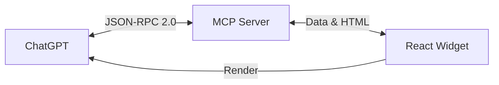

# 🎨 GPT Apps SDK - Color Accessibility Checker

**Aplicación de verificación de accesibilidad de colores integrada con ChatGPT usando el OpenAI Apps SDK y el Model Context Protocol (MCP).**

Este proyecto demuestra cómo crear una aplicación completa que se integra directamente en ChatGPT, mostrando widgets interactivos de React que se actualizan dinámicamente cuando ChatGPT realiza acciones.


## 📋 Tabla de Contenidos

- [Características](#-características)
- [¿Cómo Funciona?](#-cómo-funciona)
- [Demo en Vivo](#-demo-en-vivo)
- [Requisitos](#-requisitos)
- [Instalación Local](#-instalación-local)
- [Desarrollo Local](#-desarrollo-local)
- [Despliegue en Render](#-despliegue-en-render)
- [Integración con ChatGPT](#-integración-con-chatgpt)
- [Estructura del Proyecto](#-estructura-del-proyecto)
- [Comandos Disponibles](#-comandos-disponibles)
- [Licencia](#-licencia)

## ✨ Características

- ✅ **Widget Interactivo de React** con OpenAI Apps SDK UI
- ✅ **Servidor MCP** (Simulado/Preparado) que expone herramientas a ChatGPT
- ✅ **Actualización Dinámica** - El widget calcula contraste y combinaciones en tiempo real
- ✅ **Diseño Moderno** con Glassmorphism y componentes accesibles
- ✅ **Extracción de URL** - Analiza colores de sitios web externos
- ✅ **JSON-RPC 2.0** - Protocolo MCP estándar
- ✅ **Recursos HTML** - Widgets embebidos

## 🎯 ¿Cómo Funciona?



1. **Usuario pregunta a ChatGPT**: "Analiza los colores de google.com"
2. **ChatGPT llama al servidor MCP** (o usa la lógica interna del widget).
3. **Servidor responde** con datos estructurados + HTML del widget.
4. **ChatGPT renderiza** el widget React directamente en la conversación.
5. **Usuario interactúa** con el widget (cambiar colores, ver combinaciones).
6. **Widget se actualiza** dinámicamente.

## 🌐 Demo en Vivo

**Servidor en Producción:**
🔗 [https://color-accessibility-checker.onrender.com](https://color-accessibility-checker.onrender.com)

**Endpoint MCP:**
🔗 [https://color-accessibility-checker.onrender.com/mcp](https://color-accessibility-checker.onrender.com/mcp)

## 📋 Requisitos

- **Node.js 18+** ([Descargar](https://nodejs.org/))
- **npm** (incluido con Node.js)
- **Git** (opcional, para clonar el repositorio)

## 💻 Instalación Local

### 1️⃣ Clonar el Repositorio

```bash
git clone https://github.com/tu-usuario/color-accessibility-checker.git
cd color-accessibility-checker
```

### 2️⃣ Instalar Dependencias de Node.js

```bash
npm install
```

## � Desarrollo Local

### Opción A: Script Automático (Recomendado)

**macOS/Linux:**

```bash
npm run dev
```

Esto inicia automáticamente:
- ✅ Servidor de desarrollo Vite (puerto 5173)

## ☁️ Despliegue en Render

1. Haz un fork de este repositorio.
2. Crea un nuevo **Static Site** en Render.
3. Conecta tu repositorio.
4. Configura el comando de build: `npm run build`.
5. Configura el directorio de publicación: `dist`.

## 🤖 Integración con ChatGPT

Para probar el widget en ChatGPT:

1. Ve a **GPT Builder**.
2. Crea un nuevo GPT.
3. En **Actions**, importa el esquema OpenAPI (si usas un backend) o configura las instrucciones para usar el widget renderizado.

## 📂 Estructura del Proyecto

```
color-accessibility-checker/
├── src/
│   ├── components/
│   │   └── ColorAccessibilityWidget.tsx  # 🧩 Lógica del widget
│   ├── App.tsx                           # 📱 Componente principal
│   ├── index.css                         # 🎨 Estilos globales
│   └── main.tsx                          # 🚀 Punto de entrada
├── public/                               # 🖼 Assets estáticos
├── index.html                            # 📄 Template HTML
├── package.json                          # 📦 Dependencias
└── vite.config.ts                        # ⚙️ Configuración Vite
```

## 📜 Comandos Disponibles

| Comando | Descripción |
| :--- | :--- |
| `npm run dev` | Inicia el servidor de desarrollo local. |
| `npm run build` | Compila la aplicación para producción. |
| `npm run preview` | Vista previa de la build de producción. |

## 📄 Licencia

Este proyecto está bajo la Licencia MIT.
